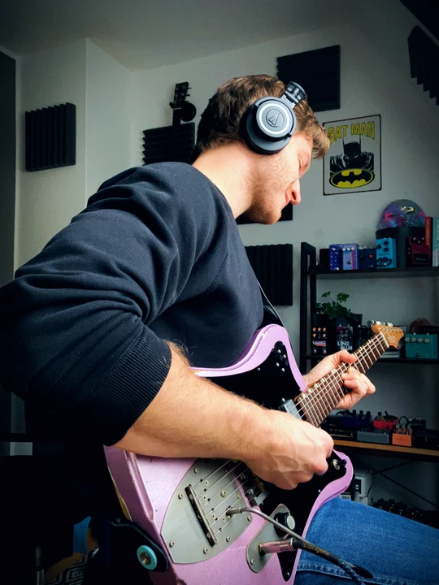

## About

Hey 👋

my name is Silvio. I'm a web developer, musician and gear nerd from Germany. I created Loopy Demos.

With this website, I produce interactive gear demos for the web. Instead of sitting through a lengthy YouTube video, you can interactively turn the knobs yourself and hear the difference in real time.

I use this little site endeavor to learn new technologies and to combine my passion for music and web development. With my skills from working professionally as a frontend engineer, I wanted to create a platform for musicians to explore gear in a new way and at the same time, have a creative musical outlet for myself.

I'm running this site as a one-man show. So if you find a bug or usability issue, or have any other feedback – tech/software or music related – shoot me a DM on [Instagram](https://www.instagram.com/loopydemos/).
